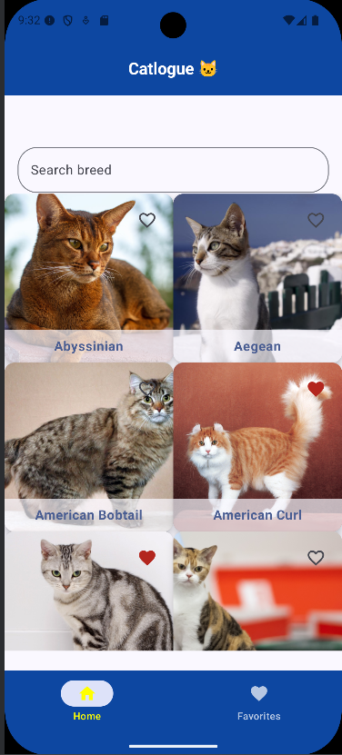
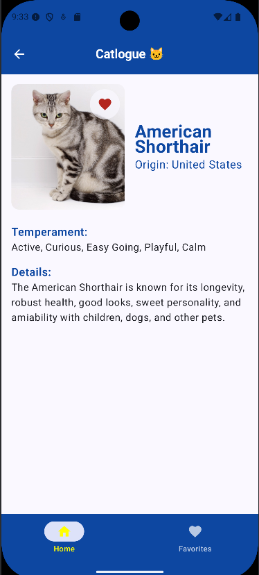
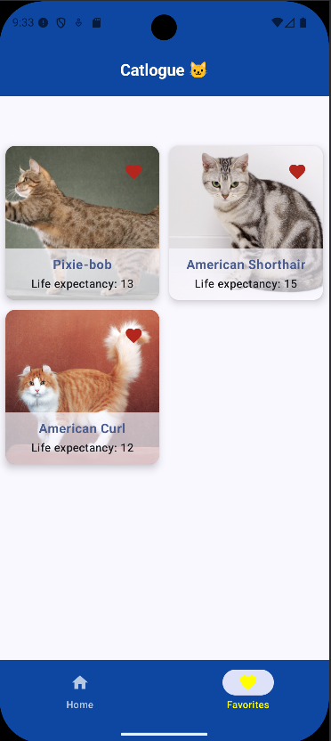

#📱 Catlogue – App de Raças de Gatos 🐱
**Resumo**:
Catlogue é um app Android desenvolvido em Kotlin com Jetpack Compose que consome a Cat API para exibir raças de gatos. Permite busca, paginação, favoritos, detalhes e funciona offline usando Room. Também possui tratamento de erros com AlertDialog para melhor experiência do usuário.

## ✅ Funcionalidades do App
- Listagem de raças de gatos
  Exibe uma lista com nome e imagem de cada raça.

- Busca por nome da raça
  Permite filtrar a lista digitando o nome da raça desejada.

- Paginação na lista de raças
  Carrega as raças em blocos (páginas), facilitando a navegação e melhorando a performance.

- Marcar/desmarcar como favorita
  Cada raça pode ser favoritada, tanto pela lista quanto pela tela de detalhes.

- Tela de favoritos
  Exibe somente as raças favoritas do usuário.

- Expectativa de vida média dos favoritos
  Mostra a média de expectativa de vida das raças favoritas.

- Tela de detalhes da raça
  Informações completas da raça, incluindo nome, origem, temperamento e descrição.

- Navegação entre telas
  Utiliza Jetpack Navigation para transitar entre lista, favoritos e detalhes.

- Armazenamento offline com Room
  Permite acesso às raças e favoritos mesmo sem conexão com a internet.

- Tratamento de erros com AlertDialog
  Mensagens de erro são exibidas para o usuário em diálogos amigáveis.

## 📁 Estrutura do Projeto
```bash
├── data/
│   ├── model/         ← Classes de dados (Breed, etc)
│   ├── remote/        ← Retrofit e API
│   ├── local/         ← Room (DAO, DB, entidades locais)
│   └── repository/    ← Repositório para acessar dados
├── ui/
│   ├── screens/       ← Pastas por tela
│   │   ├── breedlist/     ← Lista de raças
│   │   ├── breeddetails/  ← Detalhes da raça
│   │   └── favorites/     ← Tela de favoritos
│   └── components/    ← Componentes reutilizáveis (Cards, botões etc)
├── viewmodel/         ← ViewModels para lógica de UI
└── MainActivity.kt    ← Entrada principal do app
```

## 🚀 Passos de Implementação
- Criação do model Breed para mapear os dados da API (nome, origem, temperamento, descrição, expectativa de vida, imagem).
- Configuração do Retrofit para comunicação com a Cat API, incluindo autenticação via token.
- Implementação do BreedRepository para gerenciar os dados vindos da API e do banco local.
- Desenvolvimento do BreedViewModel usando StateFlow para gerenciar estados de dados, carregamento e erros.
- Criação do banco local com Room (BreedEntity, DAO, AppDatabase) para persistência offline.
- Integração do banco local com a Repository para salvar dados da API localmente.
- Implementação das telas com Jetpack Compose, incluindo lista de raças, busca e botões para favoritos.
- Desenvolvimento da navegação entre telas usando Jetpack Navigation Component.
- Implementação da tela de detalhes da raça, exibindo informações completas e botão para favoritos.
- Tela de favoritos que exibe as raças salvas e a média da expectativa de vida.
- Paginação: Carregamento inicial das 10 primeiras raças, com mais raças carregadas conforme a rolagem.
- Tratamento de erros: Implementação de AlertDialog para exibir erros ao usuário de forma clara.

## 💻 Como Rodar o Projeto
1. Clone o repositório:
```bash
git clone https://github.com/seu-usuario/catlogue.git
```
2. Abra no Android Studio (recomendo a versão mais recente).

3. Configure seu ambiente com SDK Android 31+ e Kotlin atualizado.

4. Faça o build do projeto e rode no emulador ou dispositivo físico.

5. Certifique-se de adicionar sua chave de API da Cat API no local adequado (arquivo gradle.properties ou variável de ambiente, conforme seu setup).



